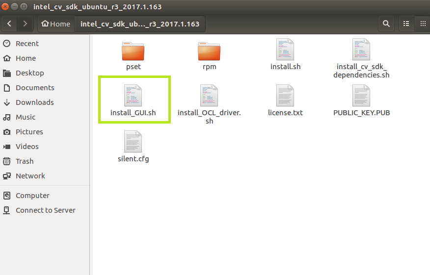

# Intel® Computer Vision SDK Setup for using the Inference Engine

## What you’ll learn
  * How to check your system requirements for a Intel® Computer Vision SDK installation.
  * How to install the OpenCL Runtime Package
  * How to install the Intel® CV SDK 
  * How to verify the Intel® CV SDK installation 

## Gather your materials
  * 5th or 6th Generation Intel® Core™ processor. You can find the product name in Linux\* by running the ‘lscpu’ command. The ‘Model name:’ contains the information about the processor.

**Note**: The generation number is embedded into the product name, right after the ‘i3’, ‘i5’, or ‘i7’.  For example, the Intel® Core™ i5-5200U processor and the Intel® Core™ i5-5675R processor are both 5th generation, and the Intel® Core™ i5-6600K processor and the Intel® Core™ i5 6360U processor are both 6th generation.

  * Ubuntu\* 16.04.2 LTS
  * In order to run inference on the integrated GPU:  
	* A processor with Intel® Iris® Pro graphics or HD Graphics 
	* No discrete graphics card installed (required by OpenCL™)
	* No drivers for other GPUs installed, or libraries built with support for other GPUs 

## Check your system requirements
This script will check your system for required hardware and software before installation.
```
python VAinstaller.py --syscheck
```
You should see something similar to:


## Install OpenCL Runtime Package
In order to run inference on the GPU, you need to first install the runtime package.  This script is made for Ubuntu 16.04.2. 
```
python VAinstaller.py --install
```
<screenshot>

## Install Intel® CV SDK
1. Go to https://software.seek.intel.com/computer-vision-software
2. Register, then download the __Ubuntu* package__

3. Unzip the contents (to a folder in your directory of choice)
4. From the folder run through the installation wizard
```
./install_GUI.sh
```


### Verify Intel® CV SDK Installation
After installation, you can run the python script again for a basic test that the installation was successful.

```
python VAinstaller.py --syscheck
```
You should see something similar to:


### Try a Sample Application Using the Inference Engine
One of the main advantages of the Intel® CV SDK is the Inference Engine, which also allows you to take advantage of the Intel® integrated GPU.  

Run the [Object Detection using Inference and SSD tutorial](../1-object-detection-ssd).


