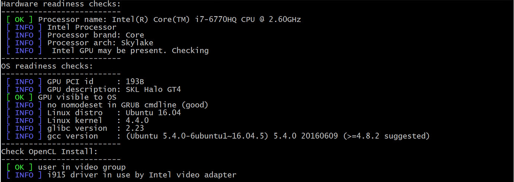
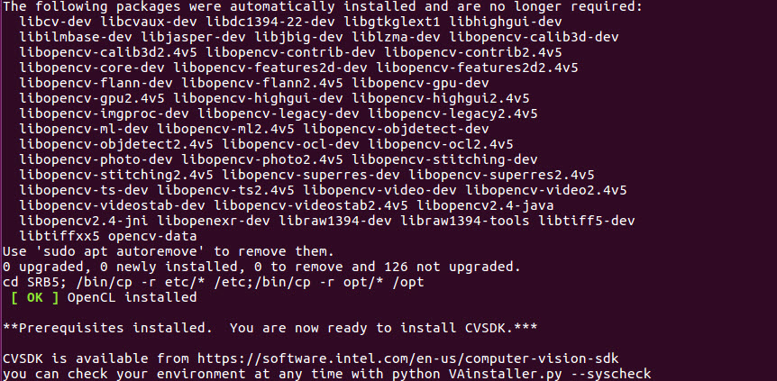
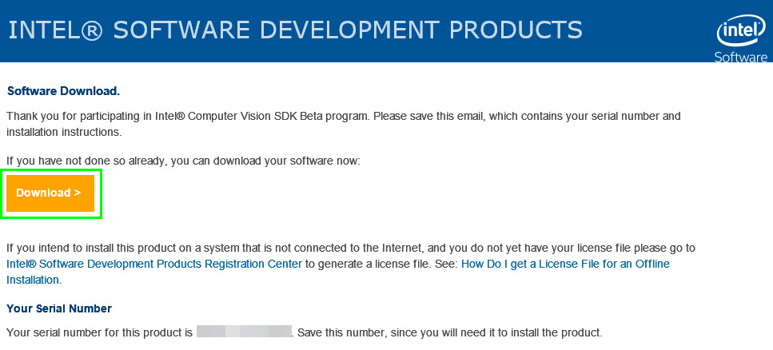
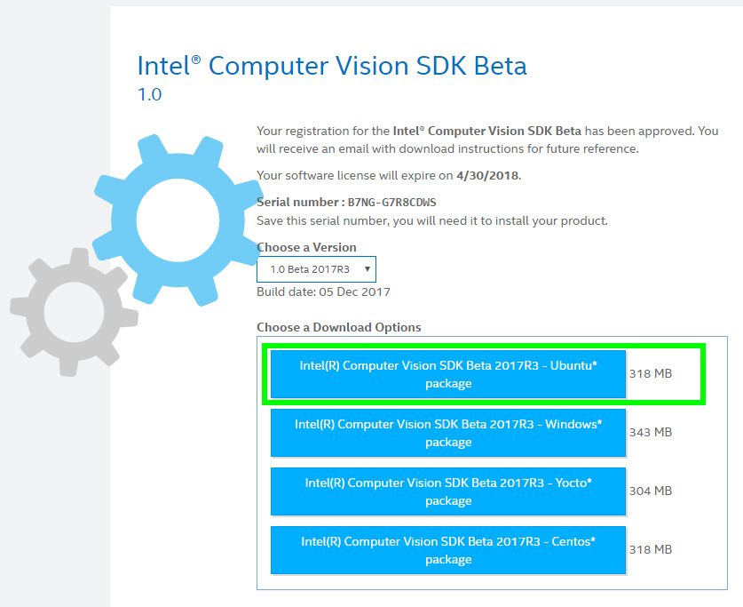
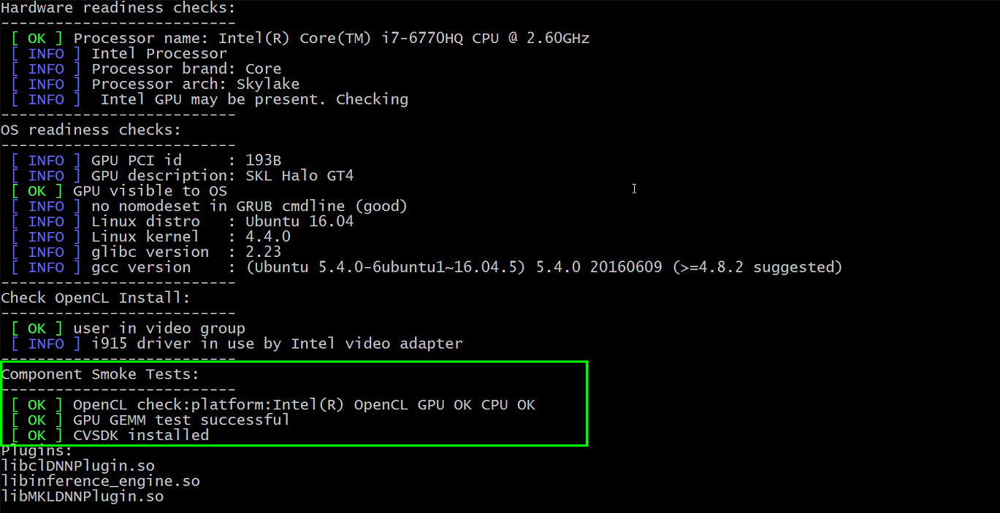

# Intel® Computer Vision SDK Setup for using the Inference Engine

## What you’ll learn
  * How to check your system requirements for a Intel® Computer Vision SDK installation.
  * How to install the OpenCL Runtime Package
  * How to install the Intel® CV SDK 
  * How to verify the Intel® CV SDK installation 

## Gather your materials
  * 5th or greater Generation Intel® Core™ processor. You can find the product name in Linux\* by running the ‘lscpu’ command. The ‘Model name:’ contains the information about the processor.

**Note**: The generation number is embedded into the product name, right after the ‘i3’, ‘i5’, or ‘i7’.  For example, the Intel® Core™ i5-5200U processor and the Intel® Core™ i5-5675R processor are both 5th generation, and the Intel® Core™ i5-6600K processor and the Intel® Core™ i5 6360U processor are both 6th generation.

  * Ubuntu\* 16.04.3 LTS
  * In order to run inference on the integrated GPU:  
	* A processor with Intel® Iris® Pro graphics or HD Graphics 
	* No discrete graphics card installed (required by OpenCL™)
	* No drivers for other GPUs installed, or libraries built with support for other GPUs 

## Get the code
### Clone this repository
```
git clone https://github.com/intel-iot-devkit/computer-vision-inference-tutorials.git
```
	
## Check your system requirements
This script will check your system for required hardware and software before installation.
```
cd computer-vision-inference-tutorials/0-setup

sudo su

python VAinstaller.py --syscheck

```
You should see something similar to:


Where there is an **[OK]** for each of the following:
```Hardware readiness checks:```  
**[OK]**  
```OS readiness checks:```  
**[OK]**  
```Check OpenCL Install:```  
**[OK]**  

If you don't see **[OK]** for all three of these, then your system in incompatible with the CV SDK.

## Install OpenCL Runtime Package
In order to run inference on the GPU, you need to first install the runtime package. This script installs the OpenCL runtime package, as well as some package dependencies required by the CV SDK. While still root user run:
```
python VAinstaller.py --install
exit
```
You should see something like:



## Install Intel® CV SDK
1. Go to https://software.seek.intel.com/computer-vision-software
2. Register, then wait for a confirmation email.  It can take *__several__* hours to get the email. So go take a break and come back once you're received the email. 

3. From the link in the email, download the __Ubuntu* package__

4. Unzip the contents (to a folder in your directory of choice)
```
tar zxvf intel_cv_sdk_r3_2017.1.163.tgz
```

5. In the cv sdk folder: 
```
cd intel_cv_sdk_r3_2017.1.163/
```
Enter super user mode  
```
sudo su
```
Then run the installation wizard  
```
./install_GUI.sh
```
and follow the instructions.

### Verify Intel® CV SDK Installation
After installation, you can run the python script again for a basic test that the installation was successful.

```
sudo su
python VAinstaller.py --syscheck
exit
```
You should see something similar to:


## Try a Sample Application Using the Inference Engine
One of the main advantages of the Intel® CV SDK is the Inference Engine, which also allows you to take advantage of the Intel® integrated GPU.  

Run the [Object Detection using Inference and SSD tutorial](../1-object-detection-ssd).


