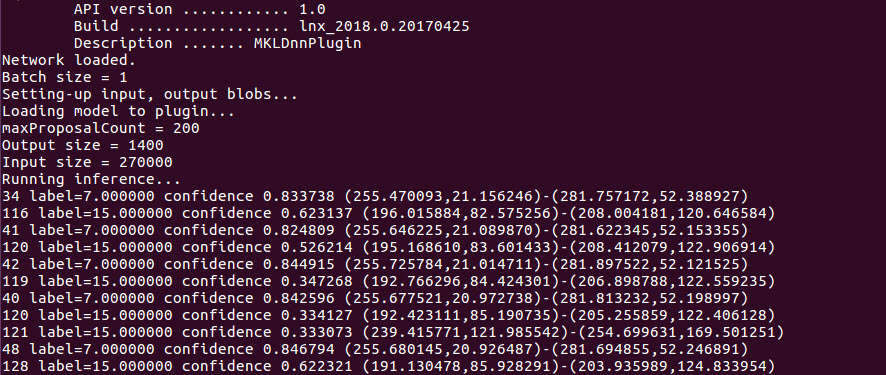
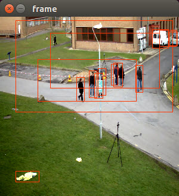
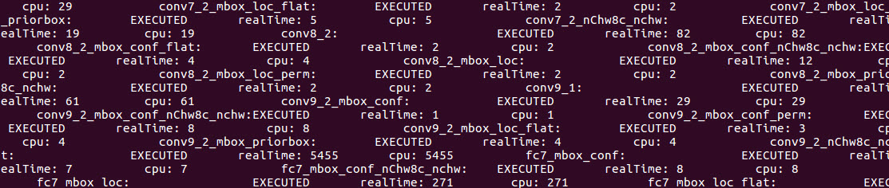

# Object Detection using Inference and SDD

This tutorial will walk you through the basics of using the Deep Learning Inference Engine included in the Intel Computer Vision SDK (CV SDK).  Inference includes using a trained neural network and feeding it an image to get the results.  Inference is typically done using a neural network architecture, such as AlexNet, GoogleNet, or Single Shot MultiBox Detector (SSD), which can be ran on various frameworks, like Caffe, Tensorflow, Torch, and more.  This example uses the Single Shot MultiBox Detector (SSD) with Caffe.

### So what's different about running a neural network on the Deep Learning Inference Engine versus the out of the box framework?  
* The Deep Learning Inference Engine optimizes the model to run *__significantly faster__* on Intel Architecture.
* It also allows inference to be ran on other harware, not just the CPU, such as the built-in Intel GPU or FPGA accelerator card.

### How does the Deep Learning Inference Engine work?
The Inference Engine takes a neural network model and optimizes it to take advantage of advanced Intel instruction sets in the CPU, and also makes it compatible with the other hardware accelerators (GPU and FPGA).  To do this, the model files, e.g., .caffemodel, .prototxt, are given to the Model Optimizer.  The Model Optimizer then processes the files and outputs two new files: a .bin and .xml.  These two files are used instead of the original model files when you run your application. In this example, the .bin and .xml files are already provided for you.


In the above diagram, IR stands for Intermediate Representation, which is just a name for the .xml and .bin files that are inputs to the Inference Engine.

If you need to 

**HOW MANY IR MODELS ARE AVAILABLE NOW? WHERE TO GET THEM?**

## What you’ll learn
  * Run the Inference Engine with an IR model in a C++ application
  * Compare performance of CPU vs GPU

## Gather your materials
* Intel Computer Vision SDK Beta r3 installed.  See [Setup insructions for how to install](../0-setup/) 
* cmake installed 
```sudo apt-get install cmake```
* Download the vtest.avi video from https://github.com/opencv/opencv/blob/master/samples/data/vtest.avi and put it in the same folder as the python script.
	
## Setup
1. If you have not already, install the Intel Computer Vision SDK, see [Setup insructions for how to install](../0-setup/).
2. In the IE_Tutorial folder, create a build folder:
```mkdir build && cd build```
3. In that folder run cmake and make:
```
cmake ..
make install
```
4. You should see a new folder created at the same level of the build folder called 'bin' which contains the binary application.  Verify the application is there in
```
/bin/intel64/Release/IE_tutorial_obj_recognition
```
5. Copy the vtest.avi (https://github.com/opencv/opencv/blob/master/samples/data/vtest.avi) into the /Release folder.

### Running the application
```
./IE_tutorial_obj_recognition -i vtest.avi -fr 500 -m SSD_GoogleNet_v2_fp32.xml -l SSD_GoogleNet_v2_fp32.bin -d CPU -t SSD -thresh 0.3
```

You should see a video play with people walking across and green bouding boxes around them:


You should also see the output in the console showing the objects found and the confidence level.



Here is the mapping for the labels of the classification:

1 - plane  
2 - bicycle  
3 - bird  
...  
**EXAMPLE, NEED ACTUAL LIST**  

Here is what the flags mean for running the application.  This can also be found by running:
```
./IE_tutorial_obj_recognition -help
```

    -h           Print a usage message
    -i <path>    Required. Path to input video file
    -fr <path>   Number of frames from stream to process
    -m <path>    Required. Path to IR .xml file.
    -l <path>    Required. Path to labels file.
    -d <device>  Infer target device (CPU or GPU)
    -t <type>    Infer type (SSD, etc)
    -pc          Enables per-layer performance report
    -thresh <val>confidence threshold for bounding boxes 0-1
    -b <val>     Batch size

In this sample video, there are approximately 790 frames, so by setting the number of frames to 790 you'll see the whole video.
```
-fr 790
```

If you change the threshold of the confidence level to 0.1, you'll see a lot more bounding boxes around the people, but also many erroneous ones.
```
-thresh 0.1
```


	
### Checking performance data
You can enable the output of performance data to the console by using the -pc flag.
```
-pc
```


**FORMATTING IS INCORRECT**

### Running on the GPU
If you installed the optional OpenCL drivers for the GPU during the CV SDK, you can try running inference on the GPU.
```
-d GPU
```

To see the performance difference between the CPU and the GPU, add the -pc flag to the different runs using the -d CPU and -d GPU flags and compare.
CPU:
```
./IE_tutorial_obj_recognition -i vtest.avi -fr 500 -m SSD_GoogleNet_v2_fp32.xml -l SSD_GoogleNet_v2_fp32.bin -d CPU -t SSD -thresh 0.3 -pc
```
GPU:
```
./IE_tutorial_obj_recognition -i vtest.avi -fr 500 -m SSD_GoogleNet_v2_fp32.xml -l SSD_GoogleNet_v2_fp32.bin -d GPU -t SSD -thresh 0.3 -pc
```

## Get the Code
<>

## How it works
<>


