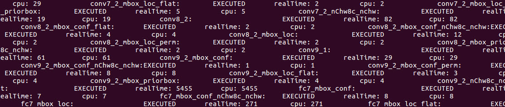

# Object Detection using Inference and Single Shot MultiBox Detector (SSD)\*

This tutorial will walk you through the basics of using the Deep Learning Deployment Toolkit's Inference Engine (included in the Intel® Computer Vision SDK). Inference includes using a trained neural network and feeding it an image to get the results. Inference is typically done using a neural network architecture, such as AlexNet\*, GoogleNet\*, or Single Shot MultiBox Detector (SSD)\*, which can be ran on various frameworks, like Caffe\*, Tensorflow\*, Torch\*, and more.  This example uses the Single Shot MultiBox Detector (SSD) with Caffe.

### So what's different about running a neural network on the Inference Engine versus an out of the box framework?  
* The Deep Learning Deployment Tookit's Inference Engine optimizes a trained model to run *__significantly faster__* on Intel® architecture.
* It also allows inference to run on hardware other than the CPU such as the built-in Intel® GPU or Intel® FPGA accelerator card.

### How does the Deep Learning Inference Engine work?
The Inference Engine takes a neural network model and optimizes it to take advantage of advanced Intel instruction sets in the CPU, and also makes it compatible with the other hardware accelerators (GPU and FPGA). To do this, the model files (e.g., .caffemodel, .prototxt) are given to the Model Optimizer which then processes the files and outputs two new files: a .bin and .xml.  These two files are used instead of the original model files when you run your application. In this example, the .bin and .xml files are provided.


In the above diagram, IR stands for Intermediate Representation, which is just a name for the .xml and .bin files that are inputs to the Inference Engine.

When you want to use another model in the Inference Engine, refer to this tutorial on how to get the necessary files using the Model Optimizer.
https://software.intel.com/en-us/inference-trained-models-with-intel-dl-deployment-toolkit-beta-2017r3

If you run into issues, don't hesitate to contact us on the forum https://software.intel.com/en-us/forums/computer-vision 

## What you’ll learn
  * How to generate the .bin and .xml (IR files) needed for the Inference Engine from a Caffe model
  * Run the Inference Engine using the IR files in a C++ application
  * Compare the performance of CPU vs GPU

## Gather your materials
* Intel® Computer Vision SDK Beta r3 installed.  See [Setup insructions for how to install](../0-setup/) 
* Download the vtest.avi video from https://github.com/opencv/opencv/blob/master/samples/data/vtest.avi 
	
## Setup
1. If you have not already, install the Intel® Computer Vision SDK, see [Setup insructions for how to install](../0-setup/).

source /opt/intel/computer_vision_sdk_2017.0.139/bin/setupvars.sh

install caffe (as root)

get model

run MO

make


2. In the IE_Tutorial folder, create a build folder:
```mkdir build && cd build```


3. In that folder run makemake:  
```
make
make install
```
4. You should see a new folder created at the same level of the build folder called 'bin' which contains the binary application.  Verify the application is there in ```/bin/intel64/Release/IE_tutorial_obj_recognition```  

	Look for ```IE_tutorial_obj_recognition```

5. Copy the vtest.avi video (https://github.com/opencv/opencv/blob/master/samples/data/vtest.avi) into the ```/Release``` folder.

## Get the Code
The code is localed in ```main.cpp``` in the same folder as this README.

### Running the application
Run this command in the `/bin/intel64/Release` folder:
```
./IE_tutorial_obj_recognition -i vtest.avi -fr 500 -m SSD_GoogleNet_v2_fp32.xml -l SSD_GoogleNet_v2_fp32.bin -d CPU -t SSD -thresh 0.3
```

You should see a video play with people walking across and red bouding boxes around them:


You should also see the output in the console showing the objects found and the confidence level.


Here is the mapping for the labels of the classification:

1 - plane  
2 - bicycle  
3 - bird  
4 - board  
5 - bottle  
6 - bus  
7 - car  
8 - cat  
9 - chair  
10 - cow  
11 - table  
12 - dog  
13 - horse  
14 - motorcycle  
15 - person  
16 - plant  
17 - sheep  
18 - sofa  
19 - train  
20 - monitor  

They can be found in ```pascal_voc_classes.txt``` in this folder.

Here is what the flags mean for running the application.  This can also be found by running:
```
./IE_tutorial_obj_recognition -help
```

    -h           Print a usage message
    -i <path>    Required. Path to input video file
    -fr <path>   Number of frames from stream to process
    -m <path>    Required. Path to IR .xml file.
    -l <path>    Required. Path to labels file.
    -d <device>  Infer target device (CPU or GPU)
    -t <type>    Infer type (SSD, etc)
    -pc          Enables per-layer performance report
    -thresh <val>confidence threshold for bounding boxes 0-1
    -b <val>     Batch size

In this sample video, there are approximately 790 frames, so by setting the number of frames to 790 you'll see the whole video.
```
-fr 790
```

If you change the threshold of the confidence level to 0.1, you'll see a lot more bounding boxes around the people, but also many false ones.
```
-thresh 0.1
```


	
### Checking performance data
You can enable the output of performance data to the console by using the `-pc` flag.
```
-pc
```


**FORMATTING IS INCORRECT**

### Running on the GPU
If you installed the optional OpenCL\* drivers for the GPU during the Intel® Computer Vision SDK installation, you can try running inference on the GPU.
```
-d GPU
```

To see the performance difference between the CPU and the GPU, add the -pc flag to the different runs using the `-d CPU` and `-d GPU` flags and compare.  

CPU:
```
./IE_tutorial_obj_recognition -i vtest.avi -fr 500 -m SSD_GoogleNet_v2_fp32.xml -l SSD_GoogleNet_v2_fp32.bin -d CPU -t SSD -thresh 0.3 -pc
```
GPU:
```
./IE_tutorial_obj_recognition -i vtest.avi -fr 500 -m SSD_GoogleNet_v2_fp32.xml -l SSD_GoogleNet_v2_fp32.bin -d GPU -t SSD -thresh 0.3 -pc
```

## How it works
Here's the high level steps that occur in the code:

-Check arguments
-Video pre-processing
-Load model to the Inference Engine
-Run Inference
-Parse the results
-Render the frame

### Video pre-processing
The video pre-processing step takes the current frame, and resizes it using the `cv2.resize()` function, https://docs.opencv.org/3.0-beta/modules/imgproc/doc/geometric_transformations.html?highlight=resize#cv2.resize, 

It also converts it to a planar format (by default it is in packed format).  Packed format is arranged like RGBRGBRGB, planar is arranged like RRRGGGBBB.

This format is required by the Inference Engine because that is the format used by the Intel® Math Kernel Library (Intel® MKL).  If you want to know more see  
https://software.intel.com/en-us/ipp-dev-reference-pixel-and-planar-image-formats
and
https://software.intel.com/en-us/ipp-dev-guide-channel-and-planar-image-data-layouts

### Load model to the Inference Engine
There are three steps to loading a model into the Inference Engine:
1. Load plugin
This is done by using the ```InferenceEnginePluginPtr _plugin()``` function.  

**__WHERE IS THIS PLUGIN LOCATED??__**

2. Read network
The network object is initialized

```InferenceEngine::CNNNetReader network;```

and then a network is read using the ReadNetwork() function

```network.ReadNetwork(FLAGS_m)```

FLAGS_m means the -m flag, which in this case is ```SSD_GoogleNet_v2_fp32.xml```

The weights are then added to the network

```network.ReadWeights(binFileName.c_str());```

**Note**: The .xml file contains the network, and the .bin contains the weights.

3. Load model into plugin

### A little info on what Model Optimizer is doing
