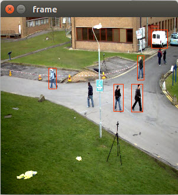
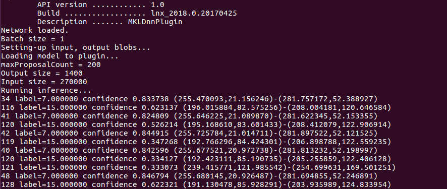
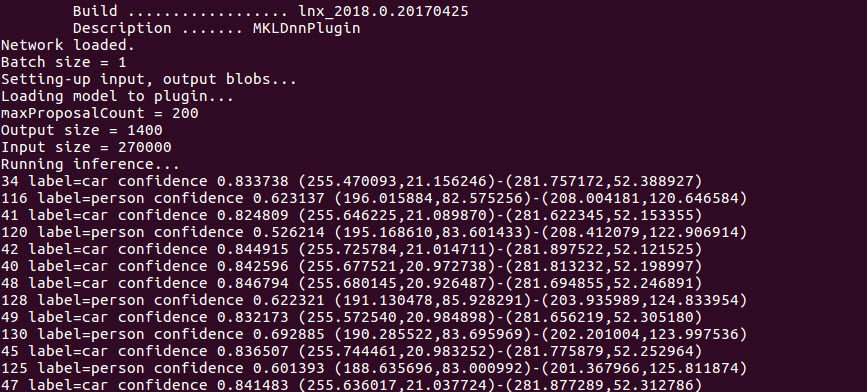
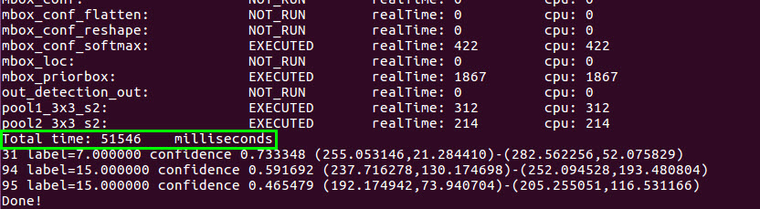
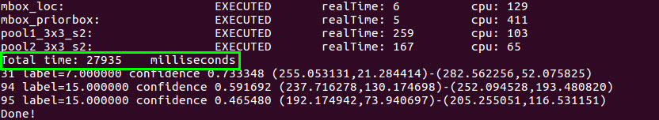
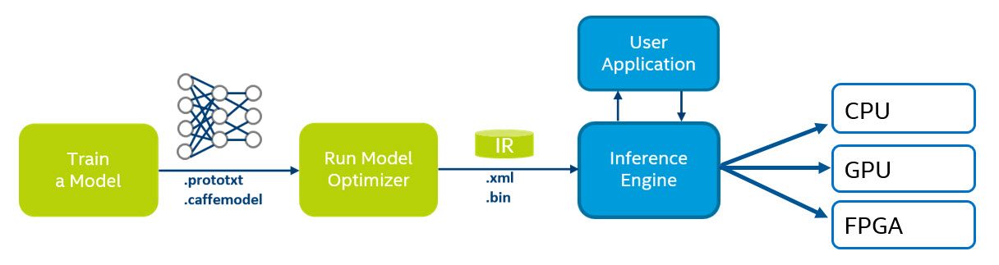

# Object Recognition using Inference and Single Shot MultiBox Detector (SSD)\*

This tutorial will walk you through the basics of using the Deep Learning Deployment Toolkit's Inference Engine (included in the Intel® Computer Vision SDK). Here, inference is the process of using a trained neural network to infer meaning from data (e.g., images). In the code sample that follows, an image is fed to the Inference Engine (our trained neural network) which then outputs a result ( classification of an image). Inference can be done using various neural network architectures (AlexNet\*, GoogleNet\*, Single Shot MultiBox Detector (SSD)\*, etc.) but this example uses the Single Shot MultiBox Detector (SSD) topology.

The Inference Engine requires that the model be converted to IR (Intermediate Representation) files.  In this example the IR files are provided for you.

### So what's different about running a neural network on the Inference Engine versus an out of the box framework?  
* The Inference Engine optimizes inference allowing a user to run deep learning deployments *__significantly faster__* on Intel® architecture.
* Inference can run on hardware other than the CPU such as the built-in Intel® GPU or Intel® FPGA accelerator card.

## What you’ll Learn
  * Run the Inference Engine using provided IR files in a C++ application
  * Compare the performance of CPU vs GPU

## Gather your materials
* Intel® Computer Vision SDK Beta r3 installed.  See [Setup insructions for how to install](../0-setup/) 
	
## Setup
If you have not already, install the Intel® Computer Vision SDK, see [Setup insructions for how to install](../0-setup/).

You need to install libgflags-dev in order to build the sample:
```
sudo apt install libgflags-dev
```

## Run the Inference Engine using the IR files in a C++ application

First get into the ```1-object-detection-ssd``` directory
```
cd 1-object-detection-ssd
```

First set the paths:
```
source /opt/intel/computer_vision_sdk_2017.1.163/bin/setupvars.sh
```

You'll need to install

Then build:
```
make
```

**Note:** If you get an error, make sure to install libgflags-dev:
```sudo apt install libgflags-dev```

Then run:
```
./IEobjectdetection -i videos/vtest.avi -fr 200 -m SSD_GoogleNet_v2_fp32.xml -d CPU -t SSD -l pascal_voc_classes.txt
```

You should see a video play with people walking across and red bouding boxes around them:



You should also see the output in the console showing the objects found and the confidence level.



Here is the mapping for the labels of the classification in the console:

1 - plane  
2 - bicycle  
3 - bird  
4 - board  
5 - bottle  
6 - bus  
7 - car  
8 - cat  
9 - chair  
10 - cow  
11 - table  
12 - dog  
13 - horse  
14 - motorcycle  
15 - person  
16 - plant  
17 - sheep  
18 - sofa  
19 - train  
20 - monitor  

They can be found in ```pascal_voc_classes.txt``` in this folder.

Here is what the flags mean for running the application.  This can also be found by running:
```
./IEobjectdetection -help
```

    -h           Print a usage message
    -i <path>    Required. Path to input video file
    -fr <path>   Number of frames from stream to process
    -m <path>    Required. Path to IR .xml file.
    -l <path>    Required. Path to labels file.
    -d <device>  Infer target device (CPU or GPU)
    -t <type>    Infer type (SSD, etc)
    -pc          Enables per-layer performance report
    -thresh <val>confidence threshold for bounding boxes 0-1
    -b <val>     Batch size

In this sample video, there are approximately 790 frames, so by setting the number of frames to 790 you'll see the whole video.
```
-fr 790
```

If you change the threshold of the confidence level to 0.1, you'll see a lot more bounding boxes around the people, but also many false ones.
```
-thresh 0.1
```
```
./IEobjectdetection -i videos/vtest.avi -fr 200 -m SSD_GoogleNet_v2_fp32.xml -d CPU -t SSD -l pascal_voc_classes.txt -thresh 0.1
```



## Compare the performance of CPU vs GPU

### CPU
You can enable the output of performance data to the console by using the `-pc` flag.
```
-pc
```
```
./IEobjectdetection -i videos/vtest.avi -fr 200 -m SSD_GoogleNet_v2_fp32.xml -d CPU -t SSD -l pascal_voc_classes.txt -pc
```
You'll see the **Total time** it took to run.


### GPU
Since you installed the OpenCL\* drivers to use the GPU, you can try running inference on the GPU and compare the difference.

**IT'S BEST TO OPEN A NEW TERMINAL WINDOW SO YOU CAN COMPARE THE RESULTS**

Make sure to source your environment variables first:
```
source /opt/intel/computer_vision_sdk_2017.1.163/bin/setupvars.sh
```
Using the GPU is set by this flag
```
-d GPU
```
```
./IEobjectdetection -i videos/vtest.avi -fr 200 -m SSD_GoogleNet_v2_fp32.xml -d GPU -t SSD -l pascal_voc_classes.txt -pc
```

You'll see the **Total time** is significantly lower when using the GPU.


## How it works

### How does the Inference Engine work?
The Inference Engine takes a representation of a neural network model and optimizes it to take advantage of advanced Intel instruction sets in the CPU, and also makes it compatible with the other hardware accelerators (GPU and FPGA). To do this, the model files (e.g., .caffemodel, .prototxt) are given to the Model Optimizer which then processes the files and outputs two new files: a .bin and .xml.  These two files are used instead of the original model files when you run your application. In this example, the .bin and .xml files are provided.



In the above diagram, IR stands for Intermediate Representation, which is just a name for the .xml and .bin files that are inputs to the Inference Engine.

When you want to use another model in the Inference Engine, refer to this tutorial on how to get the necessary files using the Model Optimizer.
https://software.intel.com/en-us/inference-trained-models-with-intel-dl-deployment-toolkit-beta-2017r3

If you run into issues, don't hesitate to contact us on the forum https://software.intel.com/en-us/forums/computer-vision 

### High level steps in the code:

- Check arguments
- Video pre-processing
- Load model to the Inference Engine
- Run Inference
- Parse the results
- Render the frame

### Video pre-processing
The video pre-processing step takes the current frame, and resizes it using the `cv2.resize()` function, https://docs.opencv.org/3.0-beta/modules/imgproc/doc/geometric_transformations.html?highlight=resize#cv2.resize, 

It also converts it to a planar format (by default it is in packed format).  Packed format is arranged like RGBRGBRGB, planar is arranged like RRRGGGBBB.

This format is required by the Inference Engine because that is the format used by the Intel® Math Kernel Library (Intel® MKL).  If you want to know more see  
https://software.intel.com/en-us/ipp-dev-reference-pixel-and-planar-image-formats
and
https://software.intel.com/en-us/ipp-dev-guide-channel-and-planar-image-data-layouts

### Loading a model into the Inference Engine
There are three steps to loading a model into the Inference Engine: load the plugin, read the network and load the model into the plugin

1. Load the plugin
This is done by using the ```InferenceEnginePluginPtr _plugin()``` function.  

2. Read the network
The network object is initialized

```InferenceEngine::CNNNetReader network;```

and then a network is read using the ReadNetwork() function

```network.ReadNetwork(FLAGS_m)```

`FLAGS_m` means the `-m` flag, which in this case is ```SSD_GoogleNet_v2_fp32.xml```

The weights are then added to the network

```network.ReadWeights(binFileName.c_str());```

**Note**: The .xml file contains the network, and the .bin file contains the weights.

3. Load the model into the plugin

## Next Steps
Try converting a model using the Model Optimizer in the [Run Model Optimizer tutorial](../2-run-model-optimizer).
