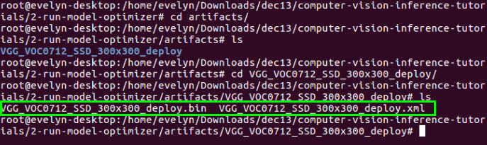

# Object Recognition using Inference and Single Shot MultiBox Detector (SSD)\*

This tutorial will walk you through the basics of using the Deep Learning Deployment Toolkit's Inference Engine (included in the Intel® Computer Vision SDK Beta R3). Here, inference is the process of using a trained neural network to infer meaning from data (e.g., images). In the code sample that follows, a video (frame by frame) is fed to the Inference Engine (our trained neural network) which then outputs a result (classification of an image). Inference can be done using various neural network architectures (AlexNet\*, GoogleNet\*, etc.). This example uses a Single Shot MultiBox Detector (SSD) on GoogleNet model.  For an example of how SSD is used see [this article](https://software.intel.com/en-us/articles/unattended-baggage-detection-using-deep-neural-networks-in-intel-architecture) on the Intel® Developer Zone.

The Inference Engine requires that the model be converted to IR (Intermediate Representation) files.  This tutorial will walk you through the basics taking an existing model (GoogleNet) and converting it to IR (Intermediate Representation) files using the Model Optimizer.

### So what's different about running a neural network on the Inference Engine versus an out of the box framework?  
* The Inference Engine optimizes inference allowing a user to run deep learning deployments *__significantly faster__* on Intel® architecture.  For more information on the performance on Intel® Processor Graphics see [this article](https://software.intel.com/en-us/articles/accelerating-deep-learning-inference-with-intel-processor-graphics)
* Inference can run on hardware other than the CPU such as the built-in Intel® GPU or Intel® FPGA accelerator card.

## What you’ll Learn
  * How to install the OpenCL™ Runtime Package
  * How to install the Intel® Computer Vision SDK Beta R3 
  * How to generate the .bin and .xml (IR files) needed for the Inference Engine from a Caffe model
  * Run the Inference Engine using the generated IR files in a C++ application
  * Compare the performance of CPU vs GPU

## Gather your materials
  * 5th or greater Generation Intel® Core™ processor. You can find the product name in Linux\* by running the ‘lscpu’ command. The ‘Model name:’ contains the information about the processor.

**Note**: The generation number is embedded into the product name, right after the ‘i3’, ‘i5’, or ‘i7’.  For example, the Intel® Core™ i5-5200U processor and the Intel® Core™ i5-5675R processor are both 5th generation, and the Intel® Core™ i5-6600K processor and the Intel® Core™ i5 6360U processor are both 6th generation.

  * Ubuntu\* 16.04.3 LTS
  * In order to run inference on the integrated GPU:  
	* A processor with Intel® Iris® Pro graphics or HD Graphics 
	* No discrete graphics card installed (required by the OpenCL™ platform).  If you have one, make sure to disable it in BIOS before going through this installation process.
	* No drivers for other GPUs installed, or libraries built with support for other GPUs   

## Setup
### Install OpenCL™ Runtime Package and other dependencies
In order to run inference on the GPU, you need to first install the OpenCL™ Runtime package. These commands install the OpenCL™ Runtime package, as well as some package dependencies required by the Intel® Computer Vision SDK Beta R3. 

**Note:** These steps are for Ubuntu 16.04.3 or later.  If you have a version older than 16.04.3, then you need to still install the Package dependencies below, then skip down to the Install Intel® Computer Vision SDK Beta R3 section for instructions on installing the OpenCL™ Driver.

Intel® Computer Vision SDK Beta R3 Package dependencies:
```
sudo apt-get update
sudo apt-get install build-essential ffmpeg cmake checkinstall pkg-config yasm libjpeg-dev curl imagemagick gedit mplayer unzip libpng12-dev libcairo2-dev libpango1.0-dev libgtk2.0-dev libgstreamer0.10-dev libswscale.dev libavcodec-dev libavformat-dev
```

OpenCL™ Runtime package:
```
wget http://registrationcenter-download.intel.com/akdlm/irc_nas/11396/SRB5.0_linux64.zip
unzip SRB5.0_linux64.zip -d SRB5.0_linux64
cd SRB5.0_linux64
```
``` 
sudo apt-get install xz-utils
mkdir intel-opencl
tar -C intel-opencl -Jxf intel-opencl-r5.0-63503.x86_64.tar.xz
tar -C intel-opencl -Jxf intel-opencl-devel-r5.0-63503.x86_64.tar.xz
tar -C intel-opencl -Jxf intel-opencl-cpu-r5.0-63503.x86_64.tar.xz
sudo cp -R intel-opencl/* /
sudo ldconfig
```

### Install Intel® Computer Vision SDK
1. Go to https://software.seek.intel.com/computer-vision-software
2. Register, then wait for a confirmation email.  It can take *__several__* hours to get the email. So go take a break and come back once you're received the email. 

If you've already registered for the Intel® CV SDK before, you should get access to download almost immediately.

  

3. From the link in the email, download the __Ubuntu\* package__
  

4. Unzip the contents (to a folder in your directory of choice)
```
tar zxvf intel_cv_sdk_ubuntu_r3_2017.1.163.tgz
```

**Note:** If you are running a version older than Ubuntu 16.04.3, then to install the OpenCL™ Driver you need to run the ```install_OCL_driver.sh``` script in the downloaded folder **before** running the Intel® CV SDK installation.  This script can take over half an hour to complete.  It will re-build the kernel with the updated driver.  Your computer will restart through the process. Make sure to backup your data before running this script.  If you prefer not to continue with this kernel re-build, then we recommend you install Ubuntu 16.04.3 or later which only needs a few files installed (instructions above) and does not need a kernel re-build.

5. In the Intel® Computer Vision SDK: 
```
cd intel_cv_sdk_ubuntu_r3_2017.1.163/
```
Enter super user mode  
```
sudo su
```
Then run the installation wizard  
```
./install_GUI.sh
```
and follow the instructions.

## Get the code
### Clone this repository
**Note:** Make sure to exit super user mode before cloning this repository.
```
git clone https://github.com/intel-iot-devkit/computer-vision-inference-tutorials.git
```

### Install Caffe
Caffe is required to convert a Caffe model using the Model Optimizer. This script will install a version of Caffe to the ```opt/intel/ssdcaffe``` folder that is compatible with the Model Optimizer.

From the `computer-vision-inference-tutorials/1-run-model-optimizer` directory 
```
cd computer-vision-inference-tutorials/1-run-model-optimizer
````
Enter in a terminal:
```
sudo su

source /opt/intel/computer_vision_sdk_2017.1.163/bin/setupvars.sh

python installSSDCaffe.py
exit
```
This should take somewhere between **10 and 20 minutes** depending on your system.

### Generate the .bin and .xml (IR files) for the Inference Engine
The Caffe model consists of two files: ```SSD_GoogleNetV2_Deploy.prototxt``` and ```SSD_GoogleNetV2_Deploy.caffemodel```. You will convert them to IR files by running the Model Optimizer using the runMO.py script.

First download the files:
```
wget https://software.intel.com/file/609199/download -O SSD_GoogleNetV2_caffe.tgz && mkdir SSD_GoogleNetV2_caffe && tar -xvzf SSD_GoogleNetV2_caffe.tgz -C SSD_GoogleNetV2_caffe
```

Go back into super user mode and run:
```
sudo su
source /opt/intel/computer_vision_sdk_2017.1.163/bin/setupvars.sh
python runMO.py -w SSD_GoogleNetV2_caffe/SSD_GoogleNetV2.caffemodel -d SSD_GoogleNetV2_caffe/SSD_GoogleNetV2_Deploy.prototxt
```
### Verify the creation of the IR files 
Look in the ```/artifacts/VGG_VOC0712_SSD_300x300_deploy``` folder.
```
cd artifacts/VGG_VOC0712_SSD_300x300_deploy
ls
```
Check that
```VGG_VOC0712_SSD_300x300_deploy.xml```
and
```VGG_VOC0712_SSD_300x300_deploy.bin```
were created in that directory



Make sure to exit super user mode before continuing
```exit```

### Run the Inference Engine using the IR files in a C++ application
**Make sure to exit super user mode before building the application**
```exit```

First set the paths:
```
source /opt/intel/computer_vision_sdk_2017.1.163/bin/setupvars.sh
```

Then build:
```
make
```

**Note:** If you get an error related to "undefined reference to 'google::FlagRegisterer...", try uninstalling libgflags-dev:
```sudo apt-get remove libgflags-dev```

Before running, download the test video file to a new ```videos``` directory:
```
wget https://github.com/opencv/opencv/raw/master/samples/data/vtest.avi -P videos/
```
To run:
```
./IEobjectdetection -i videos/vtest.avi -fr 200 -m artifacts/VGG_VOC0712_SSD_300x300_deploy/VGG_VOC0712_SSD_300x300_deploy.xml -d CPU -l pascal_voc_classes.txt
```

You should see a video play with people walking across and red bouding boxes around them.

You should also see the output in the console showing the objects found and the confidence level.


Here is what the flags mean for running the application.  This can also be found by running:
```
./IEobjectdetection -help
```

    -h           Print a usage message
    -i <path>    Required. Path to input video file
    -fr <path>   Number of frames from stream to process
    -m <path>    Required. Path to IR .xml file.
    -l <path>    Required. Path to labels file.
    -d <device>  Infer target device (CPU or GPU)
    -t <type>    Infer type (SSD, etc)
    -pc          Enables per-layer performance report
    -thresh <val>confidence threshold for bounding boxes 0-1
    -b <val>     Batch size

In this sample video, there are approximately 790 frames, so by setting the number of frames to 790 you'll see the whole video.
```
-fr 790
```

If you change the threshold of the confidence level to 0.1, you'll see a lot more bounding boxes around the people, but also many false ones.
```
-thresh 0.1
```
```
./IEobjectdetection -i videos/vtest.avi -fr 200 -m SSD_GoogleNet_v2_fp32.xml -d CPU -l pascal_voc_classes.txt -thresh 0.1
```

### Compare the performance of CPU vs GPU

#### CPU
You can enable the output of performance data to the console by using the `-pc` flag.
```
-pc
```
```
./IEobjectdetection -i videos/vtest.avi -fr 200 -m SSD_GoogleNet_v2_fp32.xml -d CPU -l pascal_voc_classes.txt -pc
```
You'll see the **Total time** it took to run.

#### GPU
Since you installed the OpenCL™ drivers to use the GPU, you can try running inference on the GPU and compare the difference.

**IT'S BEST TO OPEN A NEW TERMINAL WINDOW SO YOU CAN COMPARE THE RESULTS**

Make sure to source your environment variables first:
```
source /opt/intel/computer_vision_sdk_2017.1.163/bin/setupvars.sh
```
Using the GPU is set by this flag
```
-d GPU
```
```
./IEobjectdetection -i videos/vtest.avi -fr 200 -m SSD_GoogleNet_v2_fp32.xml -d GPU -l pascal_voc_classes.txt -pc
```

The **Total time** between CPU and GPU will vary on your system.

## How it works

### How does the Inference Engine work?
The Inference Engine takes a representation of a neural network model and optimizes it to take advantage of advanced Intel® instruction sets in the CPU, and also makes it compatible with the other hardware accelerators (GPU and FPGA). To do this, the model files (e.g., .caffemodel, .prototxt) are given to the Model Optimizer which then processes the files and outputs two new files: a .bin and .xml.  These two files are used instead of the original model files when you run your application. In this example, the .bin and .xml files are provided.


In the above diagram, IR stands for Intermediate Representation, which is just a name for the .xml and .bin files that are inputs to the Inference Engine.

When you want to use another model in the Inference Engine, refer to this tutorial on how to get the necessary files using the Model Optimizer.
https://software.intel.com/en-us/inference-trained-models-with-intel-dl-deployment-toolkit-beta-2017r3

If you run into issues, don't hesitate to contact us on the forum https://software.intel.com/en-us/forums/computer-vision 

### High level steps in the code:

- Check arguments
- Video pre-processing
- Load model to the Inference Engine
- Run Inference
- Parse the results
- Render the frame

### Video pre-processing
The video pre-processing step takes the current frame, and resizes it using the `cv2.resize()` function, https://docs.opencv.org/3.0-beta/modules/imgproc/doc/geometric_transformations.html?highlight=resize#cv2.resize, 

It also converts it to a planar format (by default it is in packed format).  Packed format is arranged like RGBRGBRGB, planar is arranged like RRRGGGBBB.

This format is required by the Inference Engine because that is the format used by the Intel® Math Kernel Library (Intel® MKL).  If you want to know more see  
https://software.intel.com/en-us/ipp-dev-reference-pixel-and-planar-image-formats
and
https://software.intel.com/en-us/ipp-dev-guide-channel-and-planar-image-data-layouts

### Loading a model into the Inference Engine
There are three steps to loading a model into the Inference Engine: load the plugin, read the network and load the model into the plugin

#### Load the plugin
This is done by using the ```InferenceEnginePluginPtr _plugin()``` function.  

#### Read the network
The network object is initialized

```InferenceEngine::CNNNetReader network;```

and then a network is read using the ReadNetwork() function

```network.ReadNetwork(FLAGS_m)```

`FLAGS_m` means the `-m` flag, which in this case is ```SSD_GoogleNet_v2_fp32.xml```

The weights are then added to the network

```network.ReadWeights(binFileName.c_str());```

**Note**: The .xml file contains the network, and the .bin file contains the weights.

#### Load the model into the plugin
Refer to the code for how to setup the input and blobs. 

### Run inference
Inference is ran using
```
_plugin->Infer(inputBlobs, outputBlobs, &dsc)
```
**Note:** The image size is resized based on the expected size in the model .xml file for every fram before inference is ran.

## Next Steps
For more information on how to generate IR files from Caffe and TensorFlow models see:

https://software.intel.com/en-us/inference-trained-models-with-intel-dl-deployment-toolkit-beta-2017r3

If you run into issues, don't hesitate to ask on our [forum](https://software.intel.com/en-us/forums/computer-vision)

