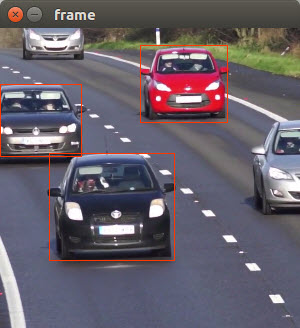

# Object Recognition using Inference and Single Shot MultiBox Detector (SSD)\*

This tutorial will walk you through the basics taking an existing model and converting it to IR (Intermediate Representation) files using Model Optimizer.

## What you’ll Learn
  * How to generate the .bin and .xml (IR files) needed for the Inference Engine from a Caffe model
  * Run the Inference Engine using the IR files in a C++ application

## Gather your materials
* Intel® Computer Vision SDK Beta r3 installed.  See [Setup insructions for how to install](../0-setup/) 
	
## Install Caffe
Caffe is required to convert a Caffe model using the Model Optimizer. This script is installing a version of Caffe that is compatible with the Model Optimizer.

From the `computer-vision-inference-tutorials/2-run-model-optimizer` directory 
```
cd 2-run-model-optimizer
````
Enter in a terminal:
```
sudo su

source /opt/intel/computer_vision_sdk_2017.1.163/bin/setupvars.sh

python installSSDCaffe.py

```
This should take somewhere between **10 and 20 minutes** depending on your system.

## Generate the .bin and .xml (IR files) for the Inference Engine
The Caffe model files (```SSD_GoogleNetV2_Deploy.prototxt``` and ```SSD_GoogleNetV2_Deploy.caffemodel```) have already been provided for you in this folder.  You will convert them to IR files by running the Model Optimizer using the runMO.py script.

While still in super user mode run:
```
python runMO.py -w SSD_GoogleNetV2.caffemodel -d SSD_GoogleNetV2_Deploy.prototxt

```
### Verify the creation of the IR files 

Look in the ```/artifacts/VGG_VOC0712_SSD_300x300_deploy``` folder.
```
cd artifacts/VGG_VOC0712_SSD_300x300_deploy
ls
```
Check that
```VGG_VOC0712_SSD_300x300_deploy.xml```
and
```VGG_VOC0712_SSD_300x300_deploy.bin```
were created in that directory


Make sure to exit super user mode before continuing
```exit```

### Remove libgflags-dev
The installation of Caffe causes a conflict with gflags, so remove the package you installed earlier by:
```sudo apt-get remove libgflags-dev```

### Run the Inference Engine using the IR files in a C++ application
**Make sure to exit super user mode before building the application**
```exit```

First setup the paths:
```
source /opt/intel/computer_vision_sdk_2017.1.163/bin/setupvars.sh 
```
Then build:
```
make
```
Then run:
```
./IEobjectdetection -i videos/cars_768x768.avi -fr 200 -m artifacts/VGG_VOC0712_SSD_300x300_deploy/VGG_VOC0712_SSD_300x300_deploy.xml -d CPU -t SSD -l pascal_voc_classes.txt
```

**Note:** If you get an error on ```make```, you may need to remove libgflags-dev, ```sudo apt-get remove libgflags-dev``` first.

**Note:** the cars_768x768.avi video file is already included as part of this repository in the /videos folder 

You should see a video play with cars passing by.



### Running with the GPU
You can run the application with the GPU as well just like you did in the previous tutorial because the Model Optimizer makes the IR files compatible for both when possible.
```
./IEobjectdetection -i videos/cars_768x768.avi -fr 200 -m artifacts/VGG_VOC0712_SSD_300x300_deploy/VGG_VOC0712_SSD_300x300_deploy.xml -d GPU -t SSD -l pascal_voc_classes.txt
```


