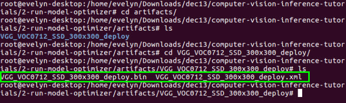

# Object Recognition using Inference and Single Shot MultiBox Detector (SSD)\*

This tutorial will walk you through the basics taking an existing model and converting it to IR (Intermediate Representation) files using the inference engine.

### Why are the IR files needed?


## What you’ll Learn
  * How to generate the .bin and .xml (IR files) needed for the Inference Engine from a Caffe model
  * Run the Inference Engine using the IR files in a C++ application

## Gather your materials
* Intel® Computer Vision SDK Beta r3 installed.  See [Setup insructions for how to install](../0-setup/) 
	
## Install Caffe
Caffe is required to convert a Caffe model using the Model Optimizer. This script is installing a version of Caffe that is compatible with the Model Optimizer.

From the `computer-vision-inference-tutorials/2-run-model-optimizer` directory 
```
cd 2-run-model-optimizer
````
Enter in a terminal:
```
sudo su

source /opt/intel/computer_vision_sdk_2017.1.163/bin/setupvars.sh

python installSSDCaffe.py

exit
```
This should take somewhere between **10 and 20 minutes** depending on your system.

## Generate the .bin and .xml (IR files) for the Inference Engine
The Caffe model files (SSD_GoogleNetV2_Deploy.prototxt and SSD_GoogleNetV2_Deploy.caffemodel) have already been provided for you in this folder.  You convert them to IR files by running the Model Optimizer using the runMO.py script.
```
sudo su

source /opt/intel/computer_vision_sdk_2017.1.163/bin/setupvars.sh

python runMO.py -w SSD_GoogleNetV2.caffemodel -d SSD_GoogleNetV2_Deploy.prototxt

```
### Verify the creation of the IR files in the ```/artifacts/VGG_VOC0712_SSD_300x300_deploy``` folder.
```
cd artifacts/VGG_VOC0712_SSD_300x300_deploy
ls
```
Check that
```SSD_GoogleNet_v2_fp32.xml```
and
```SSD_GoogleNet_v2_fp32.bin```
were created in that directory



Make sure to exit super user mode before continuing
```exit```

### Run the Inference Engine using the IR files in a C++ application
**Make sure to exit super user mode before building the application**
```exit```

First build:
```
make
```
Then run:
```
./IEobjectdetection -i videos/cars_768x768.avi -fr 200 -m artifacts/VGG_VOC0712_SSD_300x300_deploy/VGG_VOC0712_SSD_300x300_deploy.xml -d CPU -t SSD -l pascal_voc_classes.txt
```

*Note* the cars_768x768.avi video file is already included as part of this repository in the /videos folder 

You should see a video play with cars passing by.


